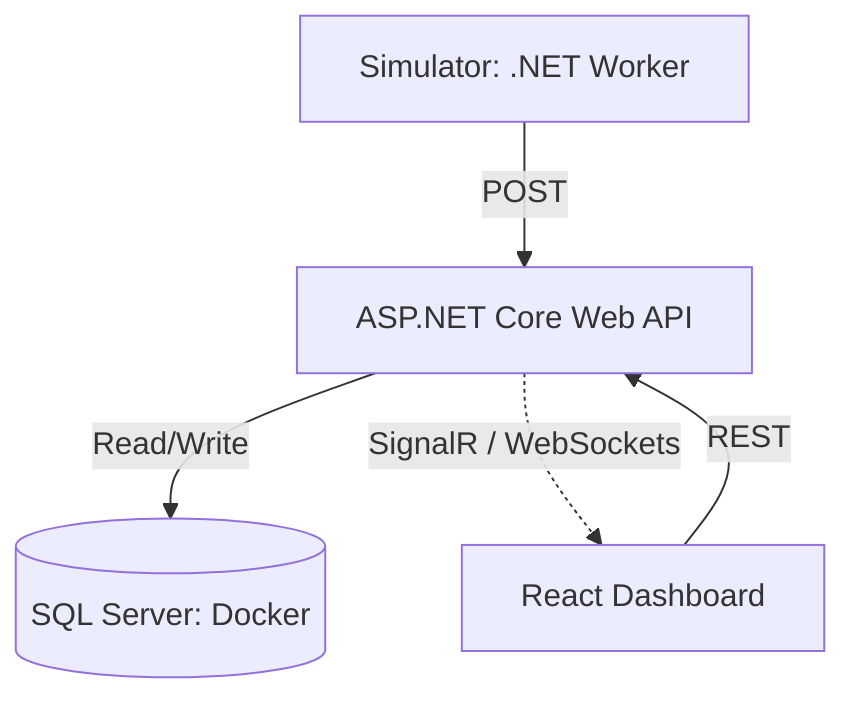
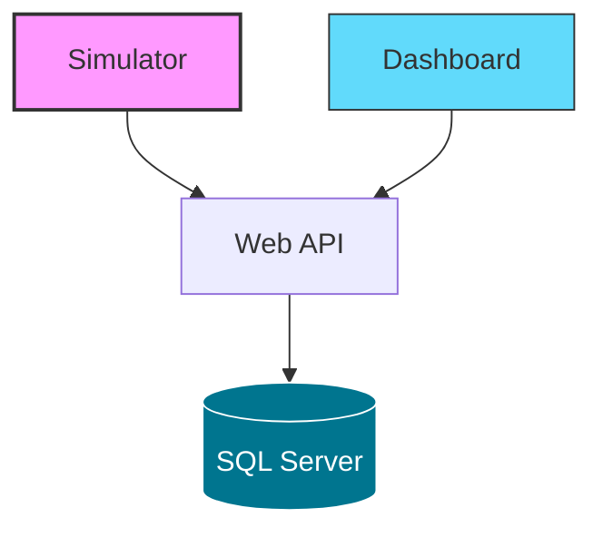

# Jyväskylä SmartCity Insights - Developer Guide

This document contains **developer-focused documentation** for running, configuring and extending the Jyväskylä SmartCity Insights platform locally.

It complements the main [`README.md`](README.md), which provides a high-level project overview.

---


---


---

## ▶️ Local Development Setup

### Prerequisites

Ensure the following tools are installed:

- **.NET 10.0 SDK**
- **Node.js 20+**
- **Docker Desktop** (recommended for database)
- **Git**

---

## Installation

### 1. Clone the Repository

   ```bash
   git clone https://github.com/hasithamanage/smartcity-insights.git
   cd smartcity-insights
   ```

### 2. Backend Setup (ASP.NET Core API)

Navigate to the API folder, apply migrations and run the service:

   ```bash
   cd backend/SmartCity.API
   dotnet ef database update
   dotnet run
   ```
*API will be available at https://localhost:5038/swagger*

### 3. Frontend Setup (React + Vite)

Ensure you have you have .env file configured in the project root:

```env
VITE_API_BASE_URL=https://localhost:5038.
```

Navigate to the frontend project, install dependancies and run the development server:

   ```bash
   cd frontend/smartcity-dashboard
   npm install
   npm run dev
   ```
*App will be available at http://localhost:5173*


### 4. Simulator Setup (IoT Data Source)

In a new terminal, start the simulation engine to generate live data:

   ```bash
   cd simulator/SmartCity.Simulator
   dotnet run
  ```

*Once running, it will continuously push simulated data to the backend API.*

---

### Database Configuration

The project uses **Azure SQL Edge** via **Docker** to ensure cross-platform compatibility between macOS, Windows and Linux.

### 1. Update the Backend Connection String

In `backend/SmartCity.Api/appsettings.Development.json` (or `appsettings.json`), update the connection string configure for **Docker**:

```JSON
"ConnectionStrings": {
  "DefaultConnection": "Server=localhost;Database=SmartCityDb;User Id=sa;Password=YourStrongPassword123!;TrustServerCertificate=True;"
}
```

### 2. Start the database 

Inside the root folder, run:

```bash
docker compose up -d smartcity-db  
```
*Wait about 20 seconds for the database to finish "waking up" inside the container.*

---

### Note:

1. **For Docker Users (Mac/Windows/Linux):** This string works as-is once the container is running.

2. **For Windows (Local SQL Server):** You may optionally use a local SQL Server installation instead of Docker: change the server to `(localdb)\\mssqllocaldb` or `.` and use `Trusted_Connection=True`.

3. Unlike local Windows SQL Server, the Docker version requires an explicit `User ID` (sa) and `Password`.


## API Documentation

The **smartcity-insights** backend exposes a fully interactive OpenAPI/Swagger UI. This allows you to test the `CityMetrics` and `Auth` endpoints directly from the browser.

```
http://localhost:5038/swagger
```

## Known Issues

This project is currently under active development. Please refer to the [Issues](https://github.com/hasithamanage/smartcity-insights/issues) section for known bugs and planned features.


### Permission Errors (UnauthorizedAccessException)

If you see "Access to path is denied" regarding the `.aspnet/DataProtection-Keys` folder in your logs:

1. Ensure your account has ownership of the .aspnet folder.

2. If using Antivirus (Avast/Norton), temporarily disable it or add an exception for the .NET runtime.

3. The project is configured to use an Ephemeral Data Provider if disk access is blocked.

### JWT Key Requirements

For local development, ensure your `appsettings.Development.json` has a `Jwt:Key` that is at least 32 characters long to satisfy the HS256 algorithm requirements.


## Contributing

Welcome contributions!  Please follow these steps:

### 1. Find or Create an Issue
Before starting any work, please ensure there is an open **Issue** describing the feature or bug. This prevents duplicate work and ensures architectural alignment.

### 2. Standard Workflow
1. **Fork** the repository.
2. **Create a branch** using a naming convention:
   - `feature/issue-number-short-description`
   - `fix/issue-number-bug-name`
3. **Commit** using [Conventional Commits](https://www.conventionalcommits.org/):
   - `feat: add real-time traffic sensor logic`
   - `fix: resolve auth token expiry race condition`
4. **Push** to your fork and open a **Pull Request**.

### 3. Pull Request Requirements
- Reference the issue number in the description (e.g: `Fixes #12`).
- Ensure all TypeScript and .NET projects build without errors.
- Follow the established project structure (Logic in Hooks/Services, UI in Components).
