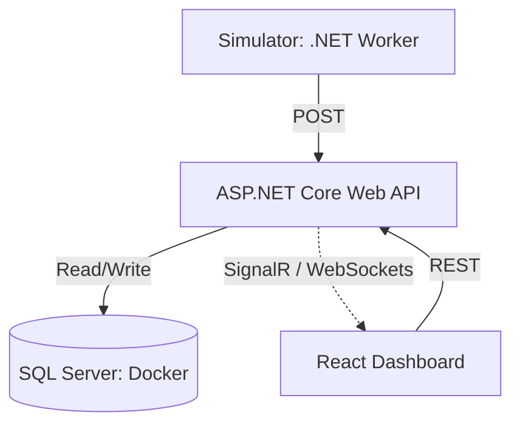
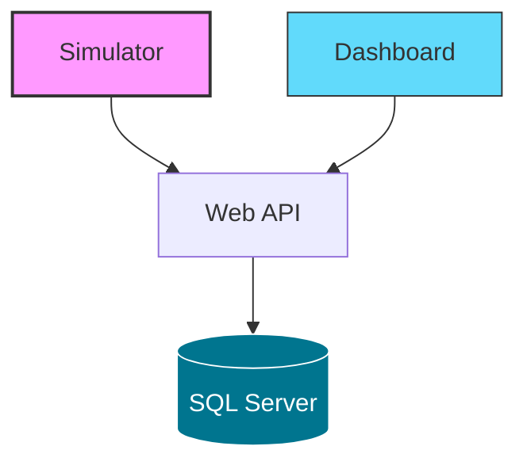

# Jyväskylä SmartCity Insights - Developer Guide

This document contains developer-focused documentation for running, configuring and extending the Jyväskylä SmartCity Insights platform locally.


---


---


---

## ▶️ Local Development Setup

### Prerequisites


- **.NET 10.0 SDK**
- **Node.js 20+**
- **Docker Desktop** (recommended for database)
- **Git**

---

## Installation

### 1. Clone the Repository

   ```bash
   git clone https://github.com/hasithamanage/smartcity-insights.git
   cd smartcity-insights
   ```

### 2. Backend Setup (ASP.NET Core API)

   ```bash
   cd backend/SmartCity.API
   dotnet ef database update
   dotnet run
   ```
API will be available at: 

```arduino
http://localhost:5038/swagger
```

### 3. Frontend Setup (React + Vite)

   ```bash
   cd frontend/smartcity-dashboard
   npm install
   npm run dev
   ```

App will be available at:

```arduino
 http://localhost:5173
 ```

Ensure you have you have `.env` file configured in the project root:

```env
VITE_API_BASE_URL=https://localhost:5038
```

### 4. Simulator Setup (IoT Data Source)


   ```bash
   cd simulator/SmartCity.Simulator
   dotnet run
  ```

The Simulator needs to know where the API is. Ensure to update `appsettings.json`:

```JSON
{
  "ApiSettings": {
    "BaseUrl": "http://localhost:5038/api"
  }
}
```
---

### Database Configuration

The project uses **Azure SQL Edge** via **Docker** to ensure cross-platform compatibility between macOS, Windows and Linux.

### 1. Update the Backend Connection String


```JSON
"ConnectionStrings": {
  "DefaultConnection": "Server=localhost;Database=SmartCityDb;User Id=sa;Password=YourStrongPassword123!;TrustServerCertificate=True;"
}
```

### 2. Start the database 

```bash
docker compose up -d smartcity-db  
```

---

### Note:

 **For Docker Users:** This string works as-is once the container is running.

**For Windows:** You may optionally use a local SQL Server installation instead of Docker: change the server to `(localdb)\\mssqllocaldb` and `Trusted_Connection=True`.

Unlike local Windows SQL Server, the Docker version requires an explicit `User ID` (sa) and `Password`.

---


## Known Issues

This project is under active development. Please check the GitHub [Issues](https://github.com/hasithamanage/smartcity-insights/issues) section for tracked bugs and planned features.

---

### Permission Errors (`UnauthorizedAccessException`)

If you see errors related to access being denied for the `.aspnet/DataProtection-Keys` directory:

**Recommended actions:**
1. Ensure your user account owns the `.aspnet` folder.
2. Temporarily disable antivirus software or add an exception for the .NET runtime.
3. The application automatically falls back to an **Ephemeral Data Protection Provider** if disk access is blocked.

---

### JWT Key Requirements

For local development, ensure `appsettings.Development.json` includes a `Jwt:Key` with **at least 32 characters**, as required by the **HS256** signing algorithm.

```JSON
"Jwt": {
    "Key": "ThisAtleast32Characters!",
    "Issuer": "YourApi",
    "Audience": "YourFrontend"
}
```

---

## Contributing Guidelines

Contributions are welcome and appreciated!

### 1️⃣ Find or Create an Issue

Before starting work, ensure there is an open **Issue** describing the bug or feature. This helps avoid duplication and keeps changes aligned with the architecture.

---

### 2️⃣  Standard Workflow

1. **Fork** the repository
2. **Create a branch** using the following naming conventions:
   - `feature/issue-number-short-description`
   - `fix/issue-number-bug-description`
3. **Commit changes** using **Conventional Commits**, for example:
   - `feat: add real-time traffic sensor logic`
   - `fix: resolve auth token expiry issue`
4. **Push** your branch and open a **Pull Request**

---

### 3️⃣ Pull Request Requirements

- Reference the related issue (e.g. `Fixes #12`)
- Ensure all **.NET** and **TypeScript** projects build successfully
- Follow the existing project structure


