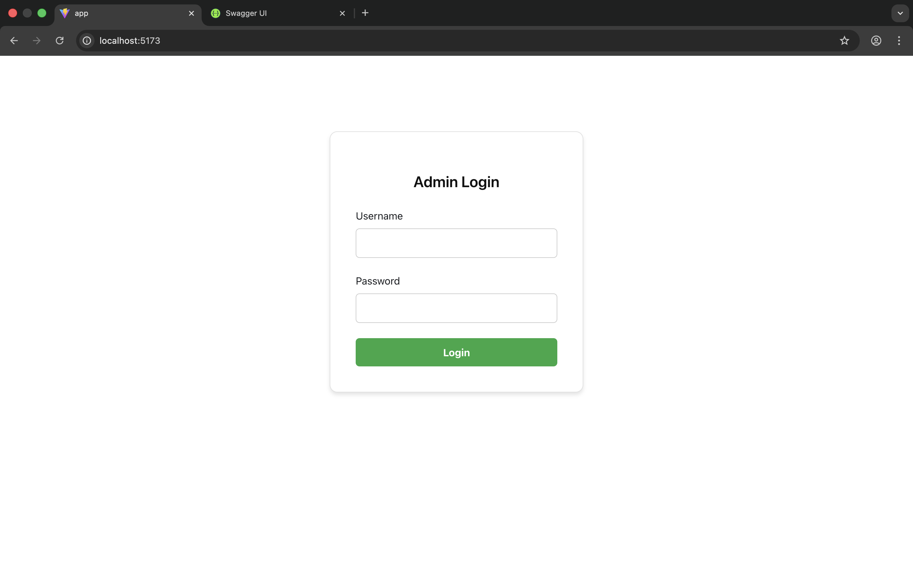
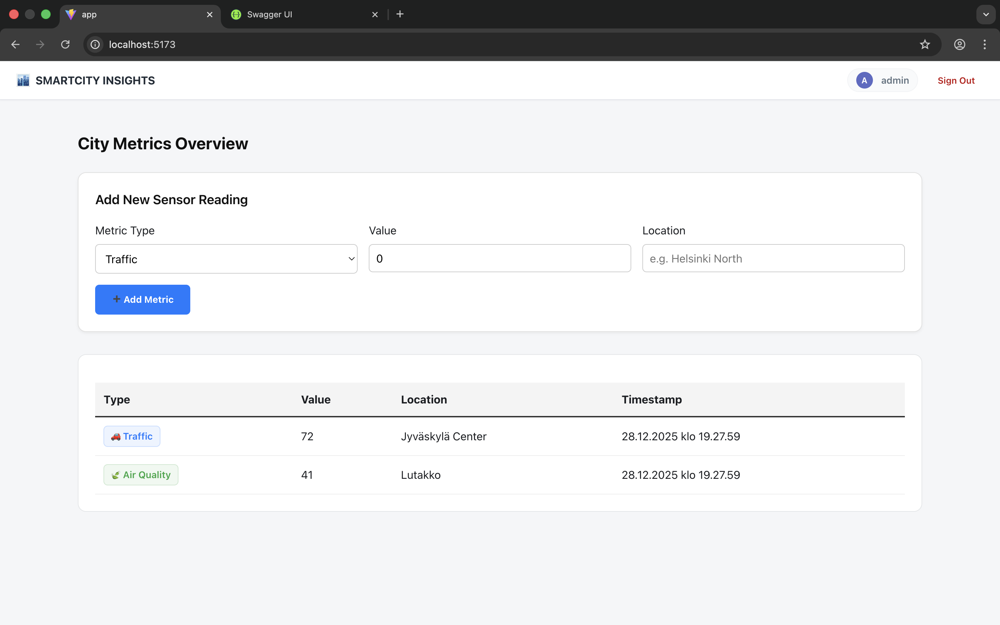
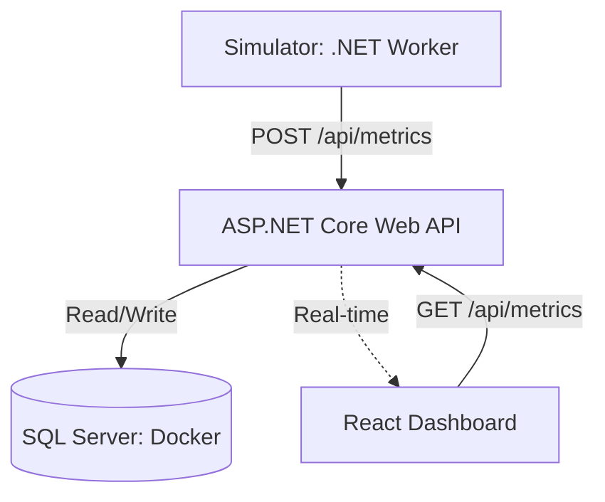

# Jyväskylä SmartCity Insights

A cloud-ready fullstack application for monitoring and analyzing city data including **traffic, energy consumption and environmental metrics**. Designed using **Clean Architecture, Domain-Driven Design and Cloud-native principles**. 

## 📋 The State of the City at a Glance

Jyväskylä SmartCity Insights displays the current state of the city and its most critical processes at a glance. It focuses on three core smart city domains: Energy transition, Living environment and Transport. The platform provides real-time monitoring and analytics for critical city infrastructure and environmental parameters.

## ✔️ Features

- **Real-time Traffic Monitoring**:  Track vehicle flow, congestion levels and optimize traffic management
- **Energy Management**: Monitor energy consumption across city infrastructure
- **Environmental Tracking**: Track air quality, noise levels and other environmental metrics
- **IoT Data Simulation:** Resilient .NET Worker-based data ingestion 
- **Responsive Dashboard**:  Full-featured web interface for data visualization
- **API-Driven Architecture:** Clean RESTful backend services

## ⚙️ Technology Stack

| Category | Technologies | Focus |
|:---|:---|:---|
| **Frontend** | `Vite`, `React 19`, `TypeScript` | **Domain Driven Architecture**, Custom Hooks, Context API, SaaS UI/UX |
| **Backend** | `.NET 10`, `ASP.NET Core Web API` | **Clean Architecture**, Global Middleware, DTO-driven Contracts |
| **Simulator** | `.NET 10 Worker Service`, `Polly` | **IoT Ingestion Simulation**, Resilience Policies, Parallel Orchestration |
| **Data & Persistence** | `SQL Server`, `EF Core` | Repository Pattern, Code-First Migrations, Database Seeding |
| **Security & Quality** | `Data Annotations`, `Middleware` | Request Validation, Error Handling, Secure API Surface |
| **Environment** | `Docker`, `Azure-ready` | Containerization & Cloud-native development |

---

## 💻 Visual Preview

### 🔐 Secure Login



*JWT-protected login with localized validation.*

---

### 📊 Dashboard



*High-level city metrics and system status overview.*

---

## 🏗️ System Architecture (High Level)

The system is designed as a decoupled micro-ecosystem where data flows from the physical (simulated) world to the end-user dashboard.




## 📦 Project Structure

```
smartcity-insights/
├── backend/                   # .NET 10 Clean Architecture Solution
│   ├── SmartCity.API/         # Controllers & Middleware
│   ├── SmartCity.Application/ # Service Interfaces & Business Logic
│   ├── SmartCity.Domain/      # Shared Entities & MetricType Enums
│   └── SmartCity.Infrastructure/ # Data Persistence (EF Core)
├── frontend/                  # React (Vite) + TypeScript
│   ├── src/api/               # Axios clients & Ingestion Services
│   ├── src/context/           # Auth & State Management
│   └── src/navigation/        # AppRouter & Auth Gates
├── simulator/                 # .NET 10 Worker Service (IoT Stimulator)
│   ├── Modules/               # Sensor logic (Traffic, Air, Energy)
│   └── Services/              # Resilience-hardened Ingestion
├── docker/                    # Multi-container orchestration
└── README.md     
```

---

## 🔄 Data Flow Summary

1. Simulator generates metric data
2. Data is sent to the API via REST endpoints
3. API validates and persists metrics
4. Frontend fetches aggregated data for visualization

---

## 🚧 Roadmap

- [ ] Real-time data streaming integration (SignalR / WebSockets)
- [ ] Advanced analytics and ML predictions
- [ ] Mobile application
- [ ] Multi-language support
- [ ] Enhanced visualization dashboards

---

## 📘 Developer setup instructions:  

See [`CONTRIBUTING.md`](Jyväskylä SmartCity Insights - Developer Guide) for details.


